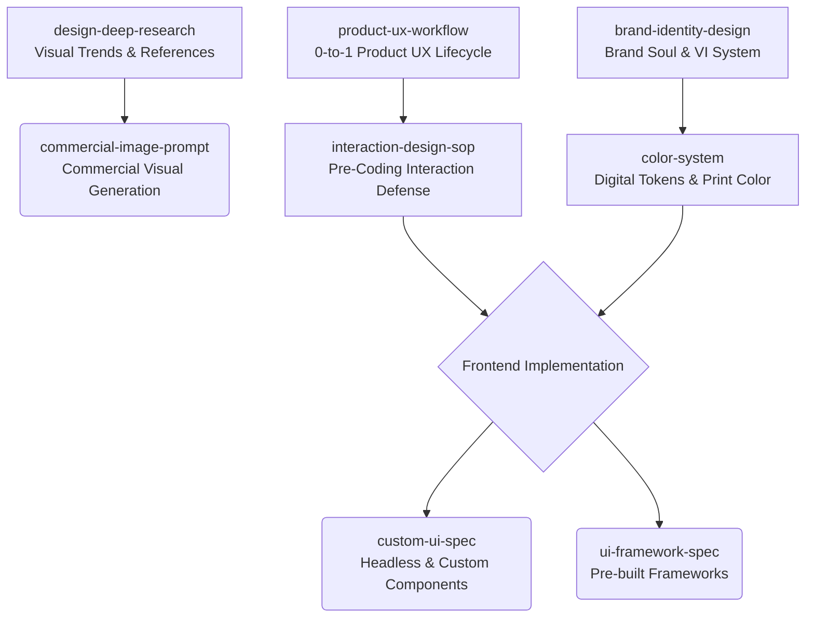

<div align="center">
  <h1>🌌 Spectra</h1>
  <p><b>Production-grade design, UX, and frontend engineering skills for AI agents.</b></p>
  
  [](LICENSE)
  [](#-skills-overview)

  <p><b>English</b> | <a href="README_zh.md">简体中文</a></p>
</div>

---

## 📖 Overview

**Spectra** is a curated suite of 8 specialized agent skills bridging the gap between brand identity, user experience design, interaction defense, multi-domain color systems, commercial visual generation, and production frontend code.

Compatible with any AI agent or coding assistant that supports standard skill extensions (such as Claude Code, Cursor, Antigravity, OpenClaw, Codex, etc.).

---

## 🚀 Getting Started

You can load the entire suite or import individual skills into your agent environment:

### Global or Project Import
Copy or symlink individual skills (or the entire `skills/` directory) into your agent's skill path:

```bash
# Example: Copy a specific skill to your agent's local skills directory
cp -r skills/color-system ~/.agent/skills/

# Or reference directly in your workspace config
# e.g., in your agent config file:
# skills:
#   - path: ./skills/product-ux-workflow/SKILL.md
#   - path: ./skills/interaction-design-sop/SKILL.md
```

Each skill is self-contained with its own `SKILL.md`, supporting references, and assets.

---

## 🧰 Skills Overview

| Skill | Domain | Description & Capabilities | Standards / Outputs |
|---|---|---|---|
| 🏷️ [`brand-identity-design`](skills/brand-identity-design/) | Brand Strategy & VI | 6-stage brand lifecycle from Brand Soul to Guardian Manual. Derives core metaphors and visual identity systems. | Metaphor derivation, VI touchpoint mapping |
| 🎨 [`color-system`](skills/color-system/) | Multi-Domain Color | Dual-domain color architecture: digital CSS tokens (`tokens.css` with dark/light mode) and graphic print/prepress standards. | WCAG AA (≥4.5:1), Pantone C/U, CMYK FOGRA39, TIC ≤300% |
| 🖼️ [`commercial-image-prompt`](skills/commercial-image-prompt/) | Commercial AI Visuals | Dual-track e-commerce visual prompting: global (Amazon, Shopify, SHEIN, TikTok) and domestic platforms (Taobao, Xiaohongshu). | 3-layer prompt structure, text-safe zones, negative prompts |
| 📐 [`custom-ui-spec`](skills/custom-ui-spec/) | Headless UI & Spec | Cross-platform UI specification generator tailored for headless components (shadcn/ui, Radix UI). | Apple HIG, Microsoft Fluent, Material 3 |
| 🔍 [`design-deep-research`](skills/design-deep-research/) | Aesthetic Research | Multi-platform visual trend discovery (Behance, Pinterest, Zcool, Savee) with 7-dimensional aesthetic deconstruction. | 7-dim deconstruction, trend clustering, verified sources |
| ⚡ [`interaction-design-sop`](skills/interaction-design-sop/) | Interaction Resilience | 7-step pre-coding defense SOP. P0/P1/P2 information hierarchy triage and 4 defensive states (empty, error, loading, destructive). | Defensive states, optimistic UI, anti-dead-end flows |
| 📋 [`product-ux-workflow`](skills/product-ux-workflow/) | Macro Product UX | 0-to-1 product UX lifecycle: success metrics, user journeys, tree-structured IA, wireframes, and PRD handoff specs. | User journey maps, IA trees, wireframe gate |
| 🧩 [`ui-framework-spec`](skills/ui-framework-spec/) | Component Frameworks | Component mapping, best practices, and migration guidelines for pre-built UI libraries (Ant Design, Element Plus, Arco, TDesign). | Component & event mapping, AntD 5.x tokens |

---

## 🏗️ Inter-Skill Architecture

Spectra skills are designed to work together across the product lifecycle:



---

## 📂 Repository Structure

```text
spectra/
├── README.md
├── README_zh.md
└── skills/
    ├── brand-identity-design/      # Brand VI system & strategy
    ├── color-system/               # Digital tokens & physical print color
    ├── commercial-image-prompt/    # Global & domestic e-commerce visual prompts
    ├── custom-ui-spec/             # Headless component design specs
    ├── design-deep-research/       # Aesthetic trend analysis & research
    ├── interaction-design-sop/     # Pre-coding interaction resilience SOP
    ├── product-ux-workflow/        # 0-to-1 product UX workflow
    └── ui-framework-spec/          # Component library specs & migration
```

---

## 📄 License

Distributed under the [Apache 2.0 License](LICENSE).