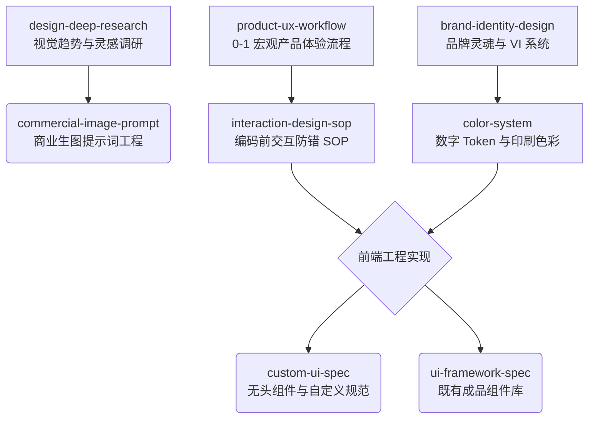

<div align="center">
  <h1>🌌 Spectra</h1>
  <p><b>面向 AI Agent 的工业级设计、UX 与前端工程技能矩阵</b></p>
  
  [](LICENSE)
  [](#-技能全景)

  <p><a href="README.md">English</a> | <b>简体中文</b></p>
</div>

---

## 📖 项目简介

**Spectra** 是一套专为 AI Agent 打造的模块化专业技能矩阵（8 大技能），打通了品牌战略、用户体验设计、交互防错韧性、宏观多领域色彩系统、商业生图提示词与前端工程落地的全链路流程。

全面兼容支持标准技能扩展的各类主流 AI Agent 与代码助手（包括 Claude Code、Cursor、Antigravity、OpenClaw、Codex 等）。

---

## 🚀 安装与使用

### 通过 ClawHub 安装（推荐）
所有技能均已发布至 [ClawHub](https://clawhub.ai) 官方商店，你可以使用 `clawhub` CLI 将所需技能直接安装至你的 Agent 环境中：

```bash
# 安装单个技能
clawhub install @fize/color-system

# 按需安装产品与前端交互全流程套件
clawhub install @fize/product-ux-workflow
clawhub install @fize/interaction-design-sop
clawhub install @fize/custom-ui-spec
```

### 本地克隆使用
你也可以通过克隆本仓库在本地离线或软链接使用：

```bash
git clone https://github.com/Fize/spectra.git
```

每个技能均为自包含模块，内含独立的 `SKILL.md` 指令、参考规约（`references/`）与资源文件（`assets/`）。

---

## 🧰 技能全景

| 技能 | 领域 | 核心能力说明 | 遵循标准 / 交付物 |
|---|---|---|---|
| 🏷️ [`brand-identity-design`](skills/brand-identity-design/) | 品牌战略与 VI | 六阶段品牌生命周期工作流（从品牌灵魂挖掘到 VI 规范手册交付）。推导核心视觉隐喻，输出多触点品牌应用指南。 | 核心隐喻推导、VI 触点映射表 |
| 🎨 [`color-system`](skills/color-system/) | 宏观多领域色彩 | 双轨色彩架构：数字产品 CSS Tokens（含 `tokens.css` 及深/浅色模式切换）与平面设计/印刷物理色彩规约。 | WCAG AA (≥4.5:1)、Pantone 专色、CMYK FOGRA39、总墨量 TIC ≤300% |
| 🖼️ [`commercial-image-prompt`](skills/commercial-image-prompt/) | 商业生图提示词 | 全球与国内双轨电商视觉提示词工程：海外平台（Amazon、Shopify、SHEIN、TikTok）与国内生态（淘宝、小红书）。 | 三层提示词架构、文字避让安全区、负向约束词 |
| 📐 [`custom-ui-spec`](skills/custom-ui-spec/) | 无头组件设计规范 | 专为无头组件库（shadcn/ui、Radix UI）定制的跨平台设计规约生成器，支持高定制化界面设计。 | Apple HIG、Microsoft Fluent、Google Material 3 |
| 🔍 [`design-deep-research`](skills/design-deep-research/) | 审美深度调研 | 跨平台视觉趋势挖掘（Behance、Pinterest、站酷、Savee），采用七维审美解构模型输出可视化 HTML 调研报告。 | 7 维审美解构、趋势聚类分析、可验证真实链接 |
| ⚡ [`interaction-design-sop`](skills/interaction-design-sop/) | 交互防错落地 | 前端编码前 7 步交互防错 SOP。P0/P1/P2 信息层级梳理与 4 种状态弹性（空态、加载态、错态、破坏性二次确认）。 | 4 大防御状态、乐观 UI 更新、防断头路流程 |
| 📋 [`product-ux-workflow`](skills/product-ux-workflow/) | 宏观产品 UX | 0 到 1 产品体验设计生命周期：度量指标、用户旅程图、树状信息架构（IA）、低保真线框原型与 PRD 交付规范。 | 用户旅程图、信息架构树、线框原型审查门禁 |
| 🧩 [`ui-framework-spec`](skills/ui-framework-spec/) | 既有组件库规范 | 主流成品 UI 组件库（Ant Design、Element Plus、Arco、TDesign）的最佳实践、组件映射与跨框架平滑迁移指南。 | 组件与事件迁移映射、AntD 5.x Design Tokens |

---

## 🏗️ 技能协同架构

Spectra 各技能协同无缝衔接，覆盖从调研、规划到工程实现的产品全生命周期：



---

## 📂 仓库结构

```text
spectra/
├── README.md                   # 英文说明文档
├── README_zh.md                # 中文说明文档
└── skills/
    ├── brand-identity-design/  # 品牌 VI 系统与战略设计
    ├── color-system/           # 数字产品 Tokens 与物理印刷色彩规约
    ├── commercial-image-prompt/# 全球/国内电商与商业生图提示词
    ├── custom-ui-spec/         # 无头组件跨平台设计规约
    ├── design-deep-research/   # 审美趋势调研与解构
    ├── interaction-design-sop/ # 编码前交互防错与状态弹性 SOP
    ├── product-ux-workflow/    # 0 到 1 宏观产品体验全流程
    └── ui-framework-spec/      # 主流 UI 框架规约与跨框架迁移
```

---

## 📄 开源协议

本项目基于 [Apache 2.0 License](LICENSE) 开源。

